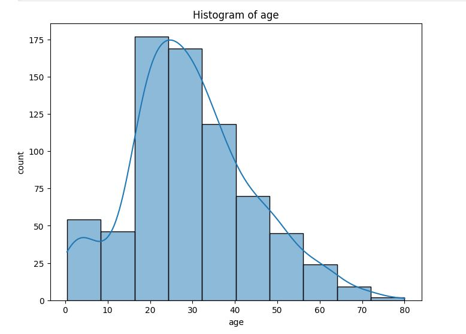

# 🚢 Titanic Survival Analysis

## 🌊 Project Overview
This project explores passenger data from the Titanic disaster to analyze survival patterns.  
By leveraging data visualization and statistical analysis, we uncover how factors such as class, gender, and age influenced survival rates during the tragic event.

## 🎯 Project Objective
- Analyze survival rates based on demographic and ticket attributes.
- Identify the most influential factors in determining survival.
- Communicate findings with clear visuals using Power BI.

## 🧠 Methodology
- **Data Cleaning**: Removed null values, encoded categorical variables.
- **Segmentation**: Grouped data by class, sex, age brackets, and fare ranges.
- **Visualization**: Created charts to represent survival proportions and class comparisons in Power BI.

**Tools Used**: Power BI, Excel, DAX

## 📊 Key Insights
- **Gender Matters**: Women had a significantly higher survival rate than men.
- **Class Disparity**: Passengers in First Class were more likely to survive compared to those in Third Class.
- **Age Range**: Children and younger passengers had slightly better survival rates than older adults.
- **Fare**: Higher ticket fares loosely correlated with higher survival rates, hinting at privilege in evacuation access.

### 📷 Age Distribution
This histogram illustrates the overall distribution of passengers age:

## ✅ Conclusion
The Titanic dataset highlights how socio-economic status and gender influenced chances of survival.  
This project demonstrates how data can bring historical events to life and inform ethical discussions around equality, access, and crisis response.

## 📁 Project Files
